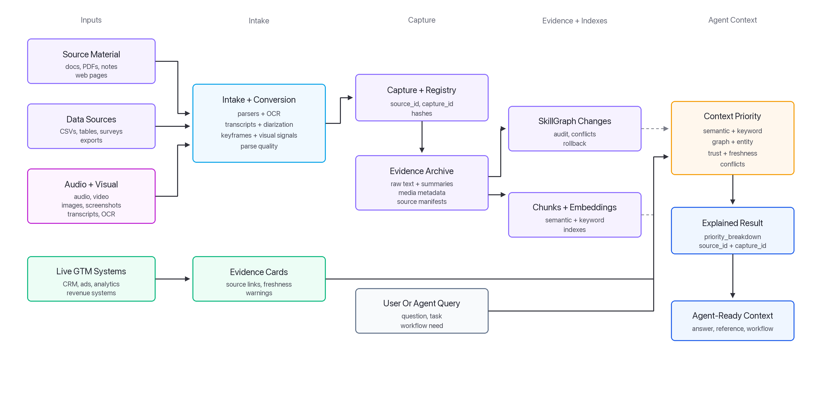

# Praxis

Praxis gives AI agents trusted access to company knowledge, operational data, and client history.

Built for teams using AI agents with CRM systems, operational data, documentation, and client-facing workflows. It turns scattered sources into searchable, source-traceable context that agents can inspect, explain, and reuse.

Unlike traditional RAG systems that retrieve chunks and stop, Praxis preserves provenance, trust, freshness, conflicts, and change history so agents can work from evidence instead of isolated documents.

Praxis Core runs locally today. Praxis Reach and Reach for Agencies extend that model to operational systems and multi-client workflows. Praxis is not a hosted service, CRM, warehouse, BI tool, or autonomous agent runtime.

## What Makes Praxis Different

Most RAG systems retrieve similar chunks and stop there. Praxis adds the working-memory layer around retrieval.

- **Provenance by default**: source IDs, capture IDs, hashes, parse quality, confidence, and source metadata stay attached.
- **Context-priority ranking**: search can combine semantic, keyword, graph, entity, trust, freshness, status, and conflict signals.
- **Warning lights for disagreement**: conflicts can be logged and surfaced instead of silently hidden inside an answer.
- **Rollbackable memory changes**: provisional SkillGraph updates are tracked through change sets, dedupe records, and rollback paths.
- **Agent reuse**: reviewed knowledge can be exported into Markdown references and skill-supporting files.

Read more: [How Praxis Core Is Different](docs/modules/core/how-core-is-different.md), [Retrieval Pipeline](docs/modules/core/retrieval-pipeline.md), and [Conflicts And Dedupe](docs/modules/core/conflicts-and-dedupe.md).

## How Praxis Turns Sources Into Agent Context



The key difference is the middle of the diagram: Praxis does not treat retrieval as "nearest chunks only." It ranks context with provenance, trust, freshness, graph state, entity hints, and conflict signals attached.

## See It Work

Install Praxis and run the Core demo:

```bash
git clone https://github.com/sparkplug604/praxis.git
cd praxis
python3 -m pip install -e .
praxis demo core
```

The demo ingests a bundled aggregate excerpt from the official Stack Overflow Developer Survey 2024/2025 archives, creates provisional graph memory, chunks it, embeds it locally, and runs an explained search. The bundled source contains aggregate CSVs plus a source manifest with URLs, dates, licenses, and checksums; it does not commit raw respondent rows.

The search step returns an explained result. Read it as:

| Question | What Praxis Shows |
| --- | --- |
| What matched? | `Stack Overflow Developer Survey AI Tooling Mini Dataset` |
| Why did it rank? | Strong semantic and keyword match, with graph context attached. |
| Can I trust the source? | Praxis reports source trust, chunk trust, freshness, active/deprecated status, and conflict penalties. |
| Are there warnings? | This demo result reports no open conflicts. |
| Where did it come from? | `source_id: src:stackoverflow-dev-survey-ai-tooling-mini` and a matching `capture_id`. |
| How was it ingested? | The result includes intake metadata such as converter, media type, and parse quality. |

The raw CLI output includes numeric scoring fields because downstream tools and tests can use them. The human takeaway is simpler: Praxis shows why context ranked, where it came from, how fresh and trusted it is, and whether conflicts are present.

If `praxis` is not recognized after installation, use Python's module form:

```bash
python3 -m praxis demo core
```

Windows PowerShell:

```powershell
py -m pip install -e .
py -m praxis demo core
```

More setup help lives in [Getting Started](docs/getting-started.md). If something fails on Windows, PATH, install, SQLite setup, search, or credentials, see [Troubleshooting](docs/troubleshooting.md).

## What Works Today

| Area | Status |
| --- | --- |
| Core source capture, ingest, chunking, local embeddings, hybrid search | Works locally |
| Context-priority ranking and `--explain` output | Works locally |
| SkillGraph changes, conflict ledger, dedupe, rollback | Works locally |
| Skill/reference export | Works locally |
| Reach fixture evidence and context packs | Works locally |
| Agency fixture demo and client capsules | Works locally |
| HubSpot connector | Experimental |
| Google Ads connector | Experimental |
| Google Analytics / GA4 connector | Experimental |
| BigQuery connector | Experimental |
| Live writeback into source systems | Not supported |
| Hosted service / multi-user cloud app | Not supported |

## Choose Your Path

| If You Want To... | Start Here | Status |
| --- | --- | --- |
| Turn docs, research, notes, and files into searchable agent knowledge. | [Core Path](docs/paths/core.md) | Available |
| Understand why Core is more than chunk-and-vector retrieval. | [How Praxis Core Is Different](docs/modules/core/how-core-is-different.md) | Available |
| Try source-linked GTM evidence and context packs without credentials. | [Reach Path](docs/paths/reach.md) | Experimental |
| Evaluate repeatable multi-client GTM workflows. | [Agency GTM Evaluation Guide](docs/modules/agency/evaluation.md) | Experimental |
| Review the full command surface. | [CLI Reference](docs/cli.md) | Available |

## How The Pieces Fit

Praxis has three related layers.

| Layer | What It Contributes |
| --- | --- |
| **Praxis Core** | Durable source knowledge: captures, chunks, embeddings, graph memory, conflict records, authority anchors, rollback, and skill/reference export. |
| **Praxis Reach** | Operational evidence: read-only connector contracts, query manifests, evidence cards, freshness checks, warnings, and compact context packs. |
| **Reach for Agencies** | Client context: per-client capsules with systems, field maps, metrics, permissions, evidence, context packs, and lifecycle state. |

The goal is not to copy every system into Praxis. The goal is to let agents work from compact, governed evidence while systems of record stay where they are.

For the deeper architecture, read:

- [How Praxis Relates To RAG, Skills, And Live Data](docs/concepts/rag-skills-live-data.md)
- [Praxis With LangChain, LangSmith, And Langflow](docs/integrations/langchain-langsmith-langflow.md)
- [How Knowledge Moves Through Praxis](docs/architecture/knowledge-flows.md)
- [Trust, Traceability, And Rollback](docs/concepts/trust-traceability-rollback.md)
- [Core Architecture](docs/modules/core/core-architecture.md)

## Repository Map

Praxis keeps source-controlled product files separate from generated local data.

| Path | Purpose |
| --- | --- |
| `src/praxis/` | Python package and CLI implementation for Core, Reach, Agency, intake, search, governance, exports, and connectors. |
| `docs/` | User guides, module docs, tutorials, connector setup notes, and architecture references. |
| `examples/` | Small source-controlled examples. Generated demo output should not live here. |
| `tests/` | Unit and CLI smoke tests for Core, Reach, Agency, intake, governance, and migration behavior. |
| `adapters/` | Optional agent-runtime and framework bridge notes. Not required for first run. |
| `scripts/` | Thin compatibility wrappers around the package CLI commands. |
| `bootstrap/` | Source-controlled starter schemas and seed data used to initialize a fresh checkout. |
| `workspace/` | Local generated runtime state: SQLite DBs, captures, vectors, evidence cards, context packs, client capsules, exports, notes, watchlists, and generated skills. Most files here are git-ignored. |

Older checkouts may still have generated data in root-level folders such as `db/`, `kg/`, `vectors/`, `research/`, `reach/`, or `agency/`. Praxis prefers `workspace/` now, but keeps temporary legacy fallback. Run this to inspect a safe migration:

```bash
praxis migrate-workspace --plan
```

## Praxis CLI

The Praxis core is the Python package and CLI. Use `praxis --help` and `praxis <command> --help` for exact options.

| Command Group | Purpose |
| --- | --- |
| `setup`, `demo`, `doctor`, `eval` | Get started, run module demos, and verify the local workspace. |
| `intake` | Inspect and convert sources before capture/ingest. |
| `capture`, `ingest`, `scan`, `refresh` | Bring source material into Praxis. |
| `chunk`, `embed`, `search`, `graph`, `library` | Index and retrieve knowledge. |
| `changes`, `conflicts`, `dedupe`, `rollback` | Inspect, resolve, merge, or undo memory changes. |
| `export-graph`, `export-skill-refs` | Export selected knowledge into references and skill-supporting files. |
| `reach` | Work with operational evidence, query manifests, freshness, and context packs. |
| `agency` | Manage client capsules and multi-client workflows. |

Full command reference: [docs/cli.md](docs/cli.md)

## Docs Map

| Need | Link |
| --- | --- |
| Full docs route map | [Docs Index](docs/README.md) |
| First install and demo | [Getting Started](docs/getting-started.md) |
| Core learning path | [Core Path](docs/paths/core.md) |
| Reach learning path | [Reach Path](docs/paths/reach.md) |
| Agency learning path | [Agency Path](docs/paths/agency.md) |
| Core module reference | [Praxis Core](docs/modules/core/README.md) |
| Reach module reference | [Praxis Reach](docs/modules/reach/README.md) |
| Agency module reference | [Praxis Reach for Agencies](docs/modules/agency/README.md) |
| Evaluation guidance | [Evaluators Index](docs/evaluators/README.md) |
| LangChain ecosystem fit | [Praxis With LangChain, LangSmith, And Langflow](docs/integrations/langchain-langsmith-langflow.md) |

## What Praxis Does Not Do Yet

Praxis is early-stage and intentionally local-first.

It is not a hosted service, not a production vector database, and not a full autonomous agent runtime. It does not automatically promote provisional graph updates into high-trust skills or policies, and it does not ship with private corpora or user-specific connectors.

Praxis Reach is also not a live CRM, ads-platform, analytics replacement, or warehouse. The current Reach module ships with mock and fixture connectors, plus experimental HubSpot, Google Ads, Google Analytics, and BigQuery connector classes. Real connectors should be read-only first, source-linked, permission-scoped, and designed so systems of record stay where they are.
