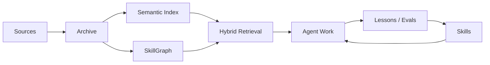
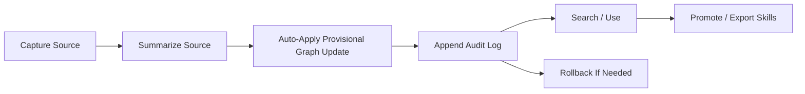

# Praxis

Praxis connects retrieval-based knowledge systems with skill-based agent behavior.

It turns documents, research, and project notes into two things agents can use: searchable knowledge and reusable skills.

Praxis captures source material from web pages, papers, documentation, local files, and project notes. It preserves the raw text, creates summaries, splits content into searchable chunks, maps relationships in a SkillGraph, and runs retrieval checks to make sure important knowledge can actually be found.

Praxis writes captured knowledge into the SkillGraph automatically as provisional, source-linked memory. Retrieved text is not treated as automatically true: source evidence, confidence metadata, change logs, and rollback commands stay attached, and selected knowledge can later be promoted into `SKILL.md`-style instructions, references, and workflows for agent runtimes.

The goal is to help AI agents work from knowledge that is searchable, source-traceable, inspectable, reversible, and reusable across tasks.

## Highlights

- **RAG + skills**: creates searchable knowledge and reusable agent instructions from the same source material.
- **Source-traceable**: keeps raw text, summaries, metadata, audit logs, and source evidence attached to graph knowledge.
- **Hybrid search**: combines semantic search, keyword search, and SkillGraph relationships.
- **Traceable auto-memory**: applies provisional SkillGraph updates automatically with source evidence, confidence metadata, audit logs, and rollback.
- **Agent-runtime ready**: exports `SKILL.md`-style instructions, references, and workflows.
- **Private-corpus friendly**: ships without private data, local paths, personal connectors, or runtime lock-in.
- **Local-first**: runs with SQLite, scripts, and offline embeddings from a normal checkout.

## Who This Is For

Praxis is for people building AI agents that need to remember, retrieve, and reuse knowledge in a way that can be checked later.

It is useful when prompt notes, ad hoc documents, or scattered research are no longer enough. Praxis helps when you need agents to work from a maintained knowledge base, not whatever context happens to fit in one chat window.

Praxis is a good fit if you:

- maintain research, documentation, project notes, or operating procedures that agents should be able to search;
- want agents to reuse accepted lessons across projects instead of rediscovering the same information;
- need source evidence attached to retrieved claims before treating them as reliable;
- want captured knowledge to be source-traceable, searchable, logged, and easy to roll back;
- want to turn trusted documentation into `SKILL.md`-style instructions, playbooks, references, or workflows;
- are building with RAG, agent memory, SkillGraphs, evals, or agent-governance patterns.

## How Praxis Relates To RAG And Skills

Praxis does not replace RAG, vector databases, knowledge graphs, memory systems, or agent skills. It connects them into one workflow.

RAG helps an agent find information. Skills help an agent repeat useful behavior. Praxis manages the path between source material, provisional knowledge, searchable retrieval, graph relationships, and reusable agent instructions.

| System | What It Gives An Agent | What It Does Not Usually Handle | Where Praxis Fits |
| --- | --- | --- | --- |
| RAG | Relevant text from documents at task time | Whether the source is trusted, current, logged, or reusable outside the current task | Praxis captures sources, preserves evidence, and makes retrieved knowledge part of an audited workflow |
| Vector database | Semantic search over embedded chunks | Source provenance, graph relationships, skill export, rollback, or agent workflow design | Praxis can use vector search as one layer, alongside full-text search, SkillGraph links, and audit records |
| Knowledge graph | Relationships between sources, concepts, claims, practices, risks, and tools | Turning those relationships into agent instructions or task-time retrieval workflows | Praxis uses a SkillGraph to make relationships searchable and useful during agent work |
| Agent memory | Stored facts, lessons, preferences, or prior work across sessions | Evidence quality, staleness, change history, rollback, and source traceability | Praxis treats memory as source-linked, confidence-tagged, reversible knowledge rather than loose remembered text |
| Agent skills | Reusable instructions, workflows, references, or tool patterns | Where the knowledge came from, how it changed, and how it should be updated | Praxis exports selected knowledge into `SKILL.md`-style artifacts with references and supporting context |
| Praxis | A pipeline for turning source material into searchable knowledge and reusable agent behavior | It is not the agent runtime itself | Praxis manages capture, evidence, audit logs, rollback, retrieval, graph relationships, evals, and skill export |

## What Praxis Does

Praxis is not just RAG. It is the loop around RAG:



Core capabilities:

- capture web, local file, and local directory sources;
- preserve raw and summarized evidence;
- auto-apply provisional SkillGraph updates with audited change sets;
- chunk source material into a semantic index;
- embed chunks with an offline local-hash provider or a real embedding provider;
- combine vector, keyword, and graph hints through hybrid search;
- export graph and library material into skill/reference artifacts;
- run health checks and retrieval evals.

## Core Layers

- `research/`: source captures, inbox scans, graph proposals, and archived applied updates.
- `vectors/`: semantic documents, chunks, and embeddings.
- `kg/`: SkillGraph schema, seed graph, and graph database.
- `db/`: relational library records for sources, practices, claims, patterns, and benchmarks.
- `scripts/`: local CLI tools for capture, indexing, graph updates, search, and health checks.
- `watchlists/`: recurring research/search targets.
- `skills/`: Praxis-owned skill artifacts and generated references.
- `adapters/`: integration notes and future adapter code for agent runtimes and frameworks.
- `docs/`: architecture notes, product framing, and implementation plans.

## Safety Model

Praxis treats memory as evidence, not truth. Captured material is stored with source context so retrieved claims can be checked instead of accepted blindly.

- The default data model is designed for documents, notes, research, summaries, graph edges, and skill references rather than secrets, credentials, or raw sensitive transcripts.
- Internet and document captures can create provisional SkillGraph updates automatically.
- Every graph mutation is recorded as a change set with before/after items so it can be inspected or rolled back.
- Graph relationships are represented as evidence-backed, confidence-tagged links, not absolute facts.
- Reverted and deprecated graph objects are hidden from normal search/export by default but remain inspectable.
- Skill artifacts are meant to stay small, inspectable, versioned, and testable.
- Local/offline embeddings are supported as the default path, with real embedding providers available when credentials and billing are configured.

## Adapter Strategy

Praxis is designed to stay framework and LLM agnostic. The core system owns source captures, evidence records, chunks, graph relationships, audit state, and skill artifacts. Adapters translate those artifacts into the format expected by each agent runtime or orchestration framework.

The adapter layer is intended to support:

- agent runtimes such as Codex, Claude Code, and Cursor/OpenCode-compatible Agent Skills;
- agent frameworks such as LangGraph, LlamaIndex, and Haystack;
- memory systems such as Mem0;
- an MCP bridge that exposes Praxis search, graph, capture, and skill operations to external tools.

## Quickstart

Clone the repository and install it in editable mode:

```bash
git clone https://github.com/sparkplug604/praxis.git
cd praxis
python3 -m pip install -e .
```

Initialize the local databases and run a health check:

```bash
praxis bootstrap
praxis doctor --require-index
praxis eval
```

Try a search:

```bash
praxis search "knowledge to skill loop"
praxis graph search "SkillGraph"
```

If you prefer not to install, run the CLI from the checkout:

```bash
PYTHONPATH=src python3 -m praxis bootstrap
PYTHONPATH=src python3 -m praxis doctor --require-index
PYTHONPATH=src python3 -m praxis search "knowledge to skill loop"
```

## Example Workflow

Praxis uses an optimistic source-ingestion path. The goal is to move quickly without losing provenance, logs, or rollback.

```bash
praxis ingest "https://example.com/source"
praxis changes list
praxis changes show "chg:..."
praxis rollback "chg:..."
praxis chunk --changed-only
praxis embed --provider local-hash
praxis search "what did this source teach us?"
```

The usual flow is:



## Command Reference

Script interface:

```bash
python3 scripts/hybrid_search.py "test-backed refactoring"
python3 scripts/search_skill_graph.py search "refactoring"
python3 scripts/ingest_source.py "https://example.com/source"
python3 scripts/graph_changes.py list
python3 scripts/rollback_graph_change.py "chg:..."
python3 scripts/research_source.py "https://example.com/source"
python3 scripts/propose_graph_update.py "cap:source-id:hash"
python3 scripts/apply_graph_update.py "research/proposals/proposal.json" --dry-run
python3 scripts/chunk_sources.py --changed-only
python3 scripts/index_vectors.py --provider local-hash
python3 scripts/eval_retrieval.py
python3 scripts/skill_doctor.py
```

Package CLI:

```bash
praxis bootstrap
praxis doctor --require-index
praxis search "knowledge to skill loop"
praxis graph search "SkillGraph"
praxis ingest "https://example.com/source"
praxis changes list
praxis rollback "chg:..."
praxis capture "https://example.com/source"
praxis chunk --changed-only
praxis embed --provider local-hash
praxis eval
```

Praxis is currently checkout/workspace-oriented. The CLI expects a Praxis root containing `scripts/`, `db/`, `kg/`, `research/`, and `vectors/`.

If you run the CLI outside the checkout, pass `--root /path/to/Praxis` or set `PRAXIS_ROOT`.

## What Praxis Does Not Do Yet

Praxis is early-stage and intentionally local-first.

- It is not a hosted service.
- It is not a replacement for production vector databases.
- It is not a full autonomous agent runtime.
- It does not automatically promote provisional graph updates into high-trust skills or policies.
- It does not ship with private corpora or user-specific connectors.
- It does not yet provide polished adapters for every target framework.

## Roadmap

- Add richer adapter examples for LangGraph, LlamaIndex, Haystack, Mem0, Codex, and Claude Code.
- Add an MCP server for search, graph, capture, and skill operations.
- Add optional LanceDB or other vector-store backends.
- Add CI, linting, and automated retrieval checks.
- Improve exports from SkillGraph into agent skill packages.
- Add screenshots or terminal recordings for first-run workflows.

## Contributing

This project is intentionally open-source friendly and lightweight.

Useful contributions include:

- clearer docs and examples;
- adapter prototypes;
- better retrieval evals;
- safer ingestion policies;
- issue reports from trying the quickstart;
- examples of Praxis-generated skills or workflows.

If you are unsure where to start, open an issue describing what you tried, what confused you, and what you expected to happen.
