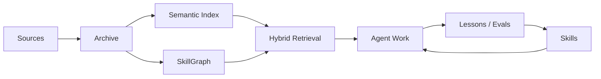
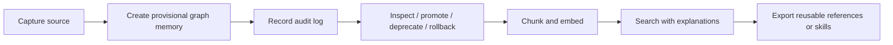

# Praxis

Praxis connects RAG-style retrieval with skill-based agent behavior.

It turns documents, research, web pages, papers, local files, and project notes into living agent knowledge: searchable when an agent needs context, reusable when that knowledge should become a skill.

Praxis captures source material, preserves the raw evidence, creates summaries, splits content into searchable chunks, and maps relationships in a SkillGraph. Search is not just vector lookup: it combines semantic retrieval, keyword matching, and graph context, then explains why each result was returned.

Captured knowledge flows into the SkillGraph automatically as provisional, source-linked memory. Nothing becomes blind "AI memory" without a trail. Every update keeps source evidence, confidence metadata, audit logs, and before/after change records attached.

From there, knowledge can be promoted, deprecated, rolled back, searched, evaluated, or exported into `SKILL.md`-style instructions, references, and workflows for agent runtimes.

Praxis gives agents a way to build on what they learn without dragging a giant context window behind them. It makes agent knowledge searchable, traceable, reversible, and reusable, so every useful source can become practical agent capability.

## Highlights

- **Turn any useful source into agent knowledge**: capture links, files, papers, docs, notes, directories, and selected watchlist hits with source metadata preserved.
- **Make agent memory traceable by default**: store raw text, summaries, chunks, hashes, source IDs, confidence, graph links, and audit logs in local SQLite databases.
- **Find the right context and see why it matched**: combine semantic search, keyword search, and SkillGraph context, with `--explain` output showing scores, sources, confidence, and graph hints.
- **Move fast without poisoning memory**: ingest captured sources into provisional SkillGraph memory, then inspect, promote, deprecate, or roll back changes through audited change sets.
- **Turn knowledge into reusable agent instructions**: export selected database and SkillGraph material into Markdown references and `SKILL.md`-style supporting files for agent runtimes.
- **Keep agent knowledge fresh from trusted sources**: define watchlists for any topic, scan trusted research and web sources, rank hits, and capture the useful ones into the same evidence pipeline.
- **Own the knowledge layer**: run with SQLite, scripts, local-hash embeddings, and optional OpenAI embeddings from a normal checkout, without locking into one hosted service, model, or agent runtime.

## Who This Is For

Praxis is for builders who are tired of agents starting from zero.

Every project teaches you something: a better workflow, a useful paper, a hard-won debugging lesson, a design decision, a prompt pattern, a failure mode. Most of that knowledge disappears into chat history, random docs, or oversized skill files.

Praxis gives that knowledge somewhere to go.

Use Praxis when you want to turn the work you are already doing into a growing agent knowledge layer: searchable, source-backed, reversible, and reusable as skills.

Praxis is especially useful if you:

- build coding agents, research agents, support agents, ops agents, or internal AI tools that need durable knowledge;
- collect docs, papers, web pages, project notes, examples, SOPs, and decisions faster than you can organize them;
- are tired of agents rediscovering the same lessons every time a new chat, project, or session starts;
- want RAG that is more than a pile of chunks: source-backed, searchable, explainable, and connected to graph memory;
- want skills and agent instructions that stay focused instead of becoming giant always-on prompt files;
- need memory that can update quickly without becoming an untraceable junk drawer;
- want agents to work from a maintained knowledge layer instead of whatever happens to fit in one prompt.

## How Praxis Relates To RAG And Skills

Praxis does not replace RAG, vector databases, knowledge graphs, memory systems, or agent skills. It connects them into one workflow.

RAG helps an agent find information. Skills help an agent repeat useful behavior. Praxis manages the path between source material, provisional knowledge, searchable retrieval, graph relationships, and reusable agent instructions.

| System | What It Gives An Agent | What It Does Not Usually Handle | Where Praxis Fits |
| --- | --- | --- | --- |
| RAG | Relevant text from documents at task time | Whether the source is trusted, current, logged, or reusable outside the current task | Praxis captures sources, preserves evidence, and makes retrieved knowledge part of an audited workflow |
| Vector database | Semantic search over embedded chunks | Source provenance, graph relationships, skill export, rollback, or agent workflow design | Praxis can use vector search as one layer, alongside full-text search, SkillGraph links, and audit records |
| Knowledge graph | Relationships between sources, concepts, claims, practices, risks, and tools | Turning those relationships into agent instructions or task-time retrieval workflows | Praxis uses a SkillGraph to make relationships searchable and useful during agent work |
| Agent memory | Stored facts, lessons, preferences, or prior work across sessions | Evidence quality, staleness, change history, rollback, and source traceability | Praxis treats memory as source-linked, confidence-tagged, reversible knowledge rather than loose remembered text |
| Agent skills | Reusable instructions, workflows, references, or tool patterns | Where the knowledge came from, how it changed, and how it should be updated | Praxis exports selected knowledge into `SKILL.md`-style artifacts with references and supporting context |
| Praxis | A pipeline for turning source material into searchable knowledge and reusable agent behavior | It is not the agent runtime itself | Praxis manages capture, evidence, audit logs, rollback, retrieval, graph relationships, evals, and skill export |

## What Praxis Does

Praxis turns scattered knowledge into searchable memory, traceable evidence, and reusable agent skills.



| Step | What It Means |
| --- | --- |
| **Sources** | Web pages, papers, docs, local files, project notes, directories, watchlist hits, and other material you want agents to learn from. |
| **Archive** | Praxis stores source text, summaries, metadata, source IDs, capture IDs, and hashes so knowledge keeps a paper trail. |
| **Semantic Index** | Captured material is split into searchable chunks and embedded for retrieval. Praxis supports local-hash embeddings by default and optional OpenAI embeddings. |
| **SkillGraph** | Sources, concepts, practices, risks, and relationships are mapped into graph memory that can be inspected, promoted, deprecated, or rolled back. |
| **Hybrid Retrieval** | Praxis combines semantic search, keyword search, and SkillGraph context, then can explain why a result matched. |
| **Agent Work** | Agents use retrieved knowledge, graph context, and exported references during real tasks instead of relying only on one chat window. |
| **Lessons / Evals** | Useful discoveries, repeated patterns, retrieval checks, and workflow lessons can be captured back into Praxis. |
| **Skills** | Selected knowledge can become `SKILL.md`-style references, playbooks, or workflows that agents load when relevant. |

## How Knowledge Moves Through Praxis

Praxis is built around a fast, reversible ingestion path.

A source can be captured, written into provisional SkillGraph memory, inspected, promoted or deprecated, indexed for retrieval, and searched with explanations. New knowledge can move quickly, but it keeps provenance, audit logs, and rollback attached.

```bash
praxis ingest "https://example.com/source"

praxis changes list
praxis changes show "chg:..."

praxis promote "chg:..."
praxis deprecate "chg:..."
praxis rollback "chg:..."

praxis chunk --changed-only
praxis embed --provider local-hash
praxis search "what did this source teach us?" --explain
```

A source moves through Praxis like this:



## Trust, Traceability, And Rollback

Praxis treats memory as evidence, not truth.

Captured material is stored with source context so claims can be checked later. SkillGraph updates are provisional by default. Every graph mutation is logged as a change set with before/after records, and reverted or deprecated graph objects are hidden from normal search/export unless you explicitly inspect them.

Praxis is built to let agents move quickly without turning memory into an untraceable junk drawer.

## Quickstart

Clone the repository and install it in editable mode:

```bash
git clone https://github.com/sparkplug604/praxis.git
cd praxis
python3 -m pip install -e .
```

Initialize the local databases and run a health check:

```bash
praxis bootstrap
praxis doctor --require-index
praxis eval
```

Try a search:

```bash
praxis search "knowledge to skill loop"
praxis graph search "SkillGraph"
```

If you prefer not to install, run the CLI from the checkout:

```bash
PYTHONPATH=src python3 -m praxis bootstrap
PYTHONPATH=src python3 -m praxis doctor --require-index
PYTHONPATH=src python3 -m praxis search "knowledge to skill loop"
```

For the full CLI reference, see [docs/cli.md](docs/cli.md). For adapter and architecture notes, see [docs/architecture.md](docs/architecture.md).

## Praxis CLI

The Praxis core is the Python package and CLI. These commands do the actual work of turning sources into traceable, searchable, reusable agent knowledge:

- `capture` and `ingest` bring in web sources, local files, directories, papers, notes, and selected watchlist hits.
- `propose`, `apply`, `changes`, `promote`, `deprecate`, and `rollback` manage SkillGraph updates through audited change sets.
- `chunk` and `embed` turn captured material into semantic documents, searchable chunks, and embeddings.
- `search`, `semantic-search`, `graph`, and `library` retrieve knowledge through semantic search, keyword search, graph traversal, and relational lookup.
- `scan`, `capture-hit`, and `refresh` help discover and refresh trusted sources over time.
- `export-graph` and `export-skill-refs` turn stored graph and database knowledge into reusable Markdown references and skill-supporting files.
- `doctor`, `eval`, and `check-embeddings` verify that the local knowledge layer is initialized, searchable, and ready to use.

Those commands write to a local workspace: `research/` for captures and proposals, `vectors/` for chunks and embeddings, `kg/` for the SkillGraph, `db/` for relational records, `watchlists/` for discovery targets, `skills/` for generated references, and `adapters/` for runtime integration notes.

## What Praxis Does Not Do (Yet)

Praxis is early-stage and intentionally local-first.

It is not a hosted service, not a production vector database, and not a full autonomous agent runtime. It does not automatically promote provisional graph updates into high-trust skills or policies, and it does not ship with private corpora or user-specific connectors.
