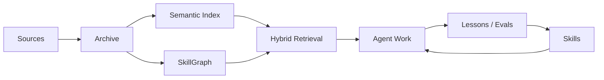

# Praxis

Praxis is an agent-agnostic knowledge-to-skill framework.

It ingests trusted sources, preserves evidence, indexes knowledge for retrieval, connects concepts in a SkillGraph, and exports practical skills/workflows that AI agents can use during real work.

Praxis is intended to be product-safe and open-source friendly: no private corpus, no user-specific connectors, no local absolute paths, and no agent runtime hard dependency.

## What Praxis Is

Praxis is not just RAG. It is the loop around RAG:



The core product thesis is simple:

> Knowledge is only valuable to an agent when it can be retrieved, trusted, and turned into reusable behavior.

## Core Layers

- `research/`: source captures, inbox scans, reviewed graph proposals, and applied updates.
- `vectors/`: semantic documents, chunks, and embeddings.
- `kg/`: SkillGraph schema, seed graph, and graph database.
- `db/`: relational library records for sources, practices, claims, patterns, and benchmarks.
- `scripts/`: local CLI tools for capture, indexing, graph updates, search, and health checks.
- `watchlists/`: recurring research/search targets.
- `skills/`: Praxis-owned skill artifacts and generated references.
- `adapters/`: integration notes and future adapter code for agent runtimes and frameworks.
- `docs/`: architecture notes, product framing, and implementation plans.

## Adapter Strategy

Praxis should stay framework and LLM agnostic. The core owns durable artifacts and evidence. Adapters translate those artifacts into the format expected by each runtime.

Initial adapter targets:

- Agent runtimes: Codex, Claude Code, Cursor/OpenCode-compatible Agent Skills.
- Agent frameworks: LangGraph, LlamaIndex, Haystack.
- Memory systems: Mem0.
- Future bridge: MCP server exposing Praxis search, graph, capture, and skill operations.

## Current Commands

Run from this folder with the script interface:

```bash
python3 scripts/hybrid_search.py "test-backed refactoring"
python3 scripts/search_skill_graph.py search "refactoring"
python3 scripts/research_source.py "https://example.com/source"
python3 scripts/propose_graph_update.py "cap:source-id:hash"
python3 scripts/apply_graph_update.py "research/proposals/proposal.json" --dry-run
python3 scripts/chunk_sources.py --changed-only
python3 scripts/index_vectors.py --provider local-hash
python3 scripts/eval_retrieval.py
python3 scripts/skill_doctor.py
```

Or use the package CLI without installing:

```bash
PYTHONPATH=src python3 -m praxis bootstrap
PYTHONPATH=src python3 -m praxis doctor --require-index
PYTHONPATH=src python3 -m praxis search "knowledge to skill loop"
PYTHONPATH=src python3 -m praxis graph search "SkillGraph"
PYTHONPATH=src python3 -m praxis capture "https://example.com/source"
PYTHONPATH=src python3 -m praxis chunk --changed-only
PYTHONPATH=src python3 -m praxis embed --provider local-hash
PYTHONPATH=src python3 -m praxis eval
```

After installing the package, use the console command:

```bash
praxis bootstrap
praxis doctor --require-index
praxis search "knowledge to skill loop"
```

Current packaging note: Praxis is checkout/workspace-oriented. The CLI expects a Praxis root containing `scripts/`, `db/`, `kg/`, `research/`, and `vectors/`. For now, prefer editable installs from a checkout:

```bash
python3 -m pip install -e .
```

If you run the CLI outside the checkout, pass `--root /path/to/Praxis` or set `PRAXIS_ROOT`.

## Safety Rules

- Do not store secrets, API keys, private credentials, or raw sensitive transcripts.
- Capture internet sources before applying durable memory changes.
- Use graph proposals and review notes before mutating the SkillGraph.
- Treat graph edges as evidence-backed hypotheses, not absolute truth.
- Keep skills small, inspectable, versioned, and testable.
