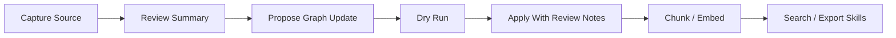
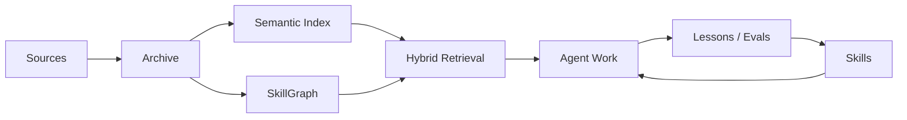

# Praxis

Praxis is an agent-agnostic **knowledge-to-skill framework**.

It helps teams turn trusted sources into searchable evidence, graph relationships, reusable agent workflows, and practical skills. In plain language: Praxis is the loop around RAG that makes knowledge usable during real agent work.

> Knowledge is only valuable to an agent when it can be retrieved, trusted, and turned into reusable behavior.

## Highlights

- **Source-to-skill loop**: capture sources, preserve evidence, index knowledge, connect concepts, and export reusable workflows.
- **More than plain RAG**: combines semantic retrieval, full-text search, and a SkillGraph instead of stopping at vector search.
- **Review-gated memory**: internet and document captures become durable knowledge only after proposal/review/apply steps.
- **Agent-agnostic by design**: built to work with Codex, Claude Code, LangGraph, LlamaIndex, Haystack, Mem0, and future adapters.
- **Private-corpus friendly**: the public scaffold ships without private data, absolute local paths, user-specific connectors, or runtime lock-in.
- **Local-first**: works from a checkout with SQLite, local scripts, and offline local-hash embeddings.

## Who This Is For

Praxis is for people building or operating AI agents who need durable, inspectable knowledge instead of one-off prompts.

It is especially useful if you:

- maintain a private research or documentation corpus;
- want agents to reuse lessons across projects;
- need source provenance before trusting retrieved knowledge;
- want to convert documentation into skills, playbooks, or agent workflows;
- are experimenting with memory, RAG, SkillGraph, or agent-governance patterns.

## Quickstart

Clone the repository and install it in editable mode:

```bash
git clone https://github.com/sparkplug604/praxis.git
cd praxis
python3 -m pip install -e .
```

Initialize the local databases and run a health check:

```bash
praxis bootstrap
praxis doctor --require-index
praxis eval
```

Try a search:

```bash
praxis search "knowledge to skill loop"
praxis graph search "SkillGraph"
```

If you prefer not to install, run the CLI from the checkout:

```bash
PYTHONPATH=src python3 -m praxis bootstrap
PYTHONPATH=src python3 -m praxis doctor --require-index
PYTHONPATH=src python3 -m praxis search "knowledge to skill loop"
```

## Example Workflow

Praxis uses a governed source-ingestion path. The goal is to avoid silently turning random internet text into durable agent memory.

```bash
praxis capture "https://example.com/source"
praxis propose "cap:source-id:hash"
praxis apply "research/proposals/proposal.json" --dry-run
praxis apply "research/proposals/proposal.json" --review-notes "Evidence checked."
praxis chunk --changed-only
praxis embed --provider local-hash
praxis search "what did this source teach us?"
```

The usual flow is:



## Praxis vs RAG vs Skills

| System | Primary Job | What It Usually Misses | Praxis Adds |
| --- | --- | --- | --- |
| Plain RAG | Retrieve relevant text | Source governance, relationships, reusable behavior | Capture review, evidence records, graph context, skill export |
| Vector DB | Store and search embeddings | Workflow, provenance, semantic relationships | CLI workflows, source registry, SkillGraph, evals |
| Agent skills | Package reusable behavior | Evidence base and update loop | Source-to-skill pipeline and indexed corpus |
| Knowledge graph | Connect concepts | Agent-facing retrieval and practical workflows | Hybrid search, skills, adapters, local operations |
| Praxis | Turn knowledge into usable agent capability | Not a hosted platform yet | Local governed knowledge-to-skill loop |

## What Praxis Does

Praxis is not just RAG. It is the loop around RAG:



Core capabilities:

- capture web, local file, and local directory sources;
- preserve raw and summarized evidence;
- propose, review, and apply SkillGraph updates;
- chunk source material into a semantic index;
- embed chunks with an offline local-hash provider or a real embedding provider;
- combine vector, keyword, and graph hints through hybrid search;
- export graph and library material into skill/reference artifacts;
- run health checks and retrieval evals.

## Core Layers

- `research/`: source captures, inbox scans, reviewed graph proposals, and applied updates.
- `vectors/`: semantic documents, chunks, and embeddings.
- `kg/`: SkillGraph schema, seed graph, and graph database.
- `db/`: relational library records for sources, practices, claims, patterns, and benchmarks.
- `scripts/`: local CLI tools for capture, indexing, graph updates, search, and health checks.
- `watchlists/`: recurring research/search targets.
- `skills/`: Praxis-owned skill artifacts and generated references.
- `adapters/`: integration notes and future adapter code for agent runtimes and frameworks.
- `docs/`: architecture notes, product framing, and implementation plans.

## Safety Model

Praxis treats memory as evidence, not truth.

- Do not store secrets, API keys, private credentials, or raw sensitive transcripts.
- Capture internet sources before applying durable memory changes.
- Use graph proposals and review notes before mutating the SkillGraph.
- Treat graph edges as evidence-backed hypotheses, not absolute truth.
- Keep skills small, inspectable, versioned, and testable.
- Prefer local/offline embeddings when credentials or billing are unavailable.

## Adapter Strategy

Praxis should stay framework and LLM agnostic. The core owns durable artifacts and evidence. Adapters translate those artifacts into the format expected by each runtime.

Initial adapter targets:

- Agent runtimes: Codex, Claude Code, Cursor/OpenCode-compatible Agent Skills.
- Agent frameworks: LangGraph, LlamaIndex, Haystack.
- Memory systems: Mem0.
- Future bridge: MCP server exposing Praxis search, graph, capture, and skill operations.

## Command Reference

Script interface:

```bash
python3 scripts/hybrid_search.py "test-backed refactoring"
python3 scripts/search_skill_graph.py search "refactoring"
python3 scripts/research_source.py "https://example.com/source"
python3 scripts/propose_graph_update.py "cap:source-id:hash"
python3 scripts/apply_graph_update.py "research/proposals/proposal.json" --dry-run
python3 scripts/chunk_sources.py --changed-only
python3 scripts/index_vectors.py --provider local-hash
python3 scripts/eval_retrieval.py
python3 scripts/skill_doctor.py
```

Package CLI:

```bash
praxis bootstrap
praxis doctor --require-index
praxis search "knowledge to skill loop"
praxis graph search "SkillGraph"
praxis capture "https://example.com/source"
praxis chunk --changed-only
praxis embed --provider local-hash
praxis eval
```

Praxis is currently checkout/workspace-oriented. The CLI expects a Praxis root containing `scripts/`, `db/`, `kg/`, `research/`, and `vectors/`.

If you run the CLI outside the checkout, pass `--root /path/to/Praxis` or set `PRAXIS_ROOT`.

## What Praxis Does Not Do Yet

Praxis is early-stage and intentionally local-first.

- It is not a hosted service.
- It is not a replacement for production vector databases.
- It is not a full autonomous agent runtime.
- It does not automatically trust or apply internet discoveries.
- It does not ship with private corpora or user-specific connectors.
- It does not yet provide polished adapters for every target framework.

## Roadmap

- Add richer adapter examples for LangGraph, LlamaIndex, Haystack, Mem0, Codex, and Claude Code.
- Add an MCP server for search, graph, capture, and skill operations.
- Add optional LanceDB or other vector-store backends.
- Add CI, linting, and automated retrieval checks.
- Improve exports from SkillGraph into agent skill packages.
- Add screenshots or terminal recordings for first-run workflows.

## Contributing

This project is intentionally open-source friendly and lightweight.

Useful contributions include:

- clearer docs and examples;
- adapter prototypes;
- better retrieval evals;
- safer ingestion policies;
- issue reports from trying the quickstart;
- examples of Praxis-generated skills or workflows.

If you are unsure where to start, open an issue describing what you tried, what confused you, and what you expected to happen.
