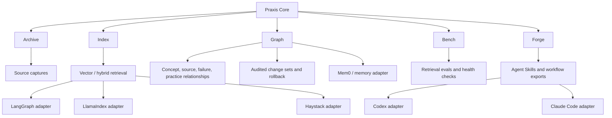
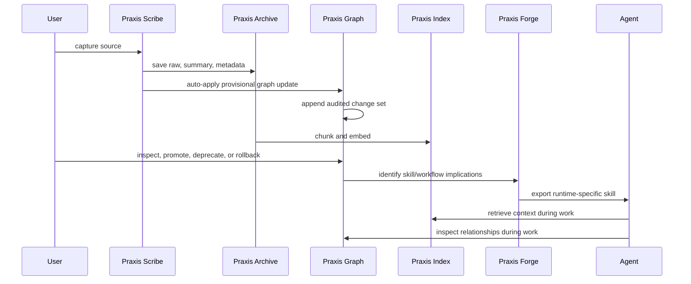

# Praxis Architecture

Praxis separates durable knowledge from runtime-specific agent behavior.

## Design Principle

The core should be stable and boring. Adapters can change quickly.

Praxis Core owns:

- source identity and provenance
- source captures and summaries
- chunk metadata and embedding records
- graph nodes, edges, evidence, confidence state, and audit logs
- watchlists and refresh state
- skill proposals and generated references
- eval results and health checks

Adapters own:

- where skills are installed
- how retrieval is exposed to a runtime
- how memory is imported/exported
- how a framework invokes Praxis tools
- how provider-specific embeddings or vector stores are configured

## Canonical Flow

## Near-Term Adapter Order

1. Codex adapter: provide one concrete agent-runtime export path.
2. Agent Skills exporter: write runtime-neutral `SKILL.md` packages.
3. Claude Code adapter: install/export compatible skills.
4. MCP server: expose Praxis to any MCP-compatible agent.
5. Framework adapters: LangGraph, LlamaIndex, Haystack.
6. Memory adapter: Mem0 import/export.
