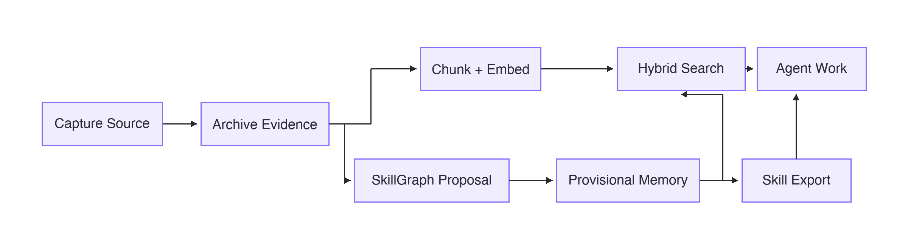
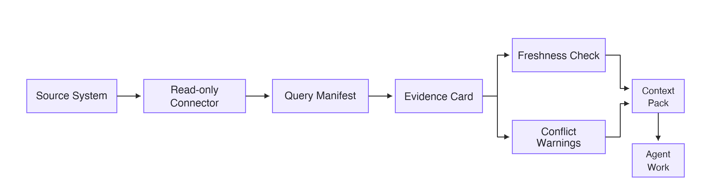
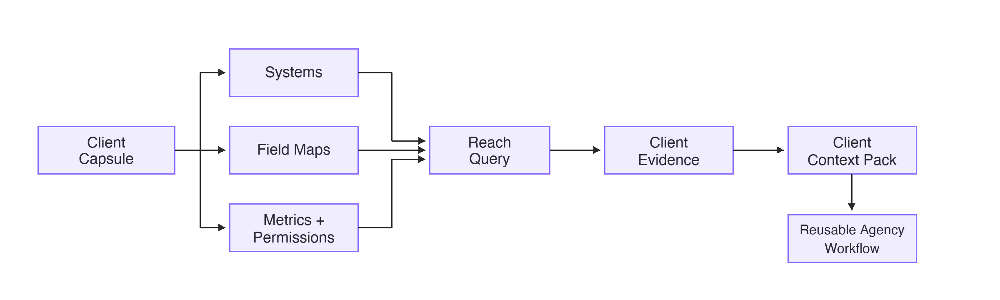

# How Knowledge Moves Through Praxis

Praxis has three related workflows: Core, Reach, and Reach for Agencies.

Each workflow turns a different kind of source context into agent-usable evidence.

## Core: Source To Skill

| Step | What Happens |
| --- | --- |
| Capture source | Praxis saves the source text, metadata, hashes, and source ID. |
| Archive evidence | Raw and summarized evidence stay attached so claims can be checked later. |
| Create provisional graph memory | New graph knowledge is added quickly, but it remains traceable and reversible. |
| Audit, inspect, or rollback | Change sets show what changed and make bad knowledge easy to unwind. |
| Chunk and embed | Captured material becomes searchable chunks and embeddings. |
| Search with explanations | Results can show why they matched, which source they came from, and whether conflicts exist. |
| Export reusable references or skills | Selected knowledge can become Markdown references or `SKILL.md`-style supporting files. |

## Reach: Live System To Context Pack

| Step | What Happens |
| --- | --- |
| Source system | The truthful operational data stays in the CRM, ads platform, analytics tool, or other source system. |
| Read-only connector | Praxis queries approved data without writing back to the source system. |
| Query manifest | Each query records the metric, source, filters, time window, and permissions. |
| Evidence card | Results are saved as compact, source-linked evidence with timestamps and freshness metadata. |
| Freshness and conflict checks | Praxis warns when evidence is stale or when sources disagree. |
| Context pack | Evidence is packaged into agent-ready context for a specific job. |
| Agent work | The agent works from compact evidence instead of raw exports or giant prompt dumps. |

## Agency: Client Capsule To Repeatable Workflow

| Step | What Happens |
| --- | --- |
| Client capsule | Each client gets an isolated local capsule. |
| Systems, field maps, metrics, and permissions | The capsule records how that client names fields, defines metrics, and limits access. |
| Reach query | Shared agency workflows run through the client's specific systems and field maps. |
| Client evidence | Results are stored as client-scoped evidence cards. |
| Client context pack | Evidence becomes a compact packet for campaign reviews, diagnostics, or reporting work. |
| Reusable agency workflow | The same workflow can run across clients without pretending every client has the same stack. |

## Core Idea

Documents become searchable knowledge, live systems become source-linked evidence, and client-specific context becomes repeatable agent workflow.

## Read Next

- [Praxis Core](../modules/core/README.md)
- [Praxis Reach](../modules/reach/README.md)
- [Praxis Reach for Agencies](../modules/agency/README.md)
