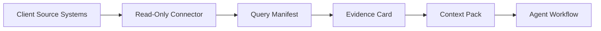

# Agency GTM Evaluation Guide

This guide is for agency owners, GTM engineers, and technical operators evaluating whether Praxis Reach and Praxis Reach for Agencies fit a multi-client workflow.

The short version: Praxis is not trying to replace your CRM, ads tools, analytics tools, or warehouse. It gives agents a source-linked evidence layer and client-specific context layer so they can work from operational data without cloning every source system into a local RAG database.

## What You Can Evaluate In 10 Minutes

Clone and install:

```bash
git clone https://github.com/sparkplug604/praxis.git
cd praxis
python3 -m pip install -e .
```

Windows PowerShell:

```powershell
git clone https://github.com/sparkplug604/praxis.git
cd praxis
py -m pip install -e .
```

Run the agency demo:

```bash
praxis demo agency
```

If `praxis` is not on your PATH:

```bash
python3 -m praxis demo agency
```

Windows PowerShell:

```powershell
py -m praxis demo agency
```

## What This Creates

The demo creates two fixture-backed clients:

```text
agency/clients/acme/
agency/clients/beta/
reach/fixtures/acme/
reach/fixtures/beta/
reach/evidence/
reach/context_packs/
```

These are local demo artifacts. No live CRM, ads platform, or analytics tool is called.

## What To Inspect

List clients:

```bash
praxis agency client list
```

Inspect one client capsule:

```bash
praxis agency client show acme
```

List evidence:

```bash
praxis reach evidence list --client acme
```

Show an evidence card:

```bash
praxis reach evidence show "ev:..."
```

Check freshness:

```bash
praxis agency stale-context-report --all
```

## What The Demo Proves

The fixture demo proves the operating model:

- per-client capsules;
- client-specific systems, field maps, metrics, and permissions;
- reusable GTM query workflows;
- per-client evidence cards;
- per-client context packs;
- freshness reporting;
- local artifact boundaries;
- client lifecycle commands for archive, export, delete-plan, delete, and purge.

## What The Demo Does Not Prove Yet

The fixture demo does not prove:

- production live CRM extraction;
- live extraction across every agency stack;
- Meta Ads support;
- writeback into client systems;
- row-level data warehousing;
- hosted multi-user permissions;
- full compliance automation.

Those are separate product layers. The current design intentionally starts with read-only evidence and local client capsules.

## Current Connector Status

| Connector | Status |
| --- | --- |
| `fixture_crm` / `fixture_ads` | Works now for demos. |
| `mock_crm` / `mock_ads` | Works now for local testing. |
| `hubspot` | Experimental real connector. |
| `google_ads` | Experimental real connector. |
| `google_analytics` | Experimental real connector for GA4. |

## How Live Systems Fit

For live systems, the intended flow is:



The source system remains the source of truth. Praxis stores the evidence card, not a full copy of the operational database.

## What An Agency Engineer Should Evaluate

When reviewing the repo, look at:

- whether client capsules match how your agency separates client context;
- whether query manifests are a useful contract for repeatable GTM questions;
- whether evidence cards contain enough source links, timestamps, freshness, and warnings;
- whether context packs are useful for agent workflows;
- whether the read-only boundary is the right default;
- which connector should be hardened first for your actual stack.

## Useful Commands

```bash
praxis demo agency
praxis agency client list
praxis agency client show acme
praxis reach evidence list --client acme
praxis reach evidence show "ev:..."
praxis agency stale-context-report --all
praxis agency client export acme
```

## Next Questions For Evaluators

- Which live system would you need first?
- Which GTM question would you want as the first production query manifest?
- Is aggregate evidence enough, or do you need row-level drilldown?
- What freshness SLA would make the context trustworthy?
- What would make the generated context pack useful inside your agent workflow?
