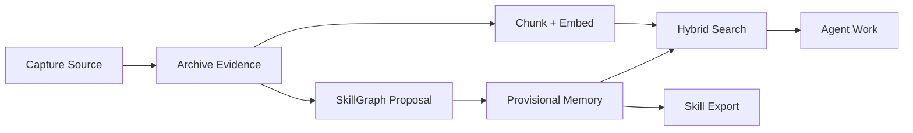

# Praxis Core

Praxis Core is the local knowledge layer at the heart of Praxis.

It turns documents, research, web pages, local files, project notes, and lessons from real work into searchable, source-traceable, reusable agent knowledge.

Core is where Praxis handles:

- source capture;
- raw evidence preservation;
- summaries and metadata;
- structure-aware chunking;
- embeddings;
- hybrid search;
- SkillGraph updates;
- conflict and dedupe records;
- rollback;
- skill/reference export.

## What Core Is For

Use Praxis Core when you want agents to remember and reuse knowledge without stuffing everything into the prompt.

Core is useful for:

- coding agents that should reuse project lessons;
- research agents that need source-backed claims;
- teams building RAG systems with provenance;
- people maintaining private documentation or research libraries;
- agent skill builders who want `SKILL.md`-style files backed by real sources;
- workflows where memory needs to be searchable, inspectable, and reversible.

## How Core Works



Core does not treat captured text as automatically true. It stores the evidence, records how knowledge entered the system, and makes changes reversible.

## First Run

Run the demo:

```bash
praxis demo core
```

Or run the pieces manually:

```bash
praxis bootstrap
praxis doctor --require-index
praxis ingest "https://example.com/source"
praxis chunk --changed-only
praxis embed --provider local-hash
praxis search "what did this source teach us?" --explain
```

## Common Core Commands

| Command | What It Does |
| --- | --- |
| `praxis capture` | Captures a URL, file, or directory. |
| `praxis ingest` | Captures a source and writes provisional SkillGraph memory. |
| `praxis chunk` | Turns captured sources into searchable chunks. |
| `praxis embed` | Embeds pending chunks. |
| `praxis search` | Runs hybrid semantic, keyword, and graph search. |
| `praxis graph` | Searches or traverses the SkillGraph. |
| `praxis changes` | Lists and inspects graph change sets. |
| `praxis conflicts` | Lists and resolves conflict records. |
| `praxis dedupe` | Reviews duplicate source/entity candidates. |
| `praxis rollback` | Reverts an audited change set. |
| `praxis export-skill-refs` | Exports selected knowledge into reusable Markdown references. |

## Search And Ranking

`praxis search` ranks by context priority by default.

That means Praxis considers:

- semantic relevance;
- keyword relevance;
- graph links;
- source trust;
- freshness;
- active/deprecated status;
- unresolved conflicts.

Use this when you want the most useful context first:

```bash
praxis search "chunking strategy for RAG" --explain
```

Use raw retrieval order when debugging:

```bash
praxis search "chunking strategy for RAG" --rank-by relevance
```

## Conflict And Dedupe Handling

Core can log:

- duplicate URLs;
- duplicate content hashes;
- similar titles;
- possible duplicate entities;
- claim-like contradictions.

Conflict records are not magic truth judgments. They are warning lights. They help you inspect suspicious memory before it spreads into search or skill exports.

## Skill Export

Core can export reviewed knowledge into skill-supporting files:

```bash
praxis export-skill-refs
```

This is the bridge between RAG and skills: useful knowledge can start as source evidence, become searchable memory, and later become reusable agent instructions.

## What Core Does Not Do Yet

Core is not a hosted memory service, not a production vector database, and not an autonomous agent runtime.

It gives you a local, inspectable knowledge layer that other agents and runtimes can use.
