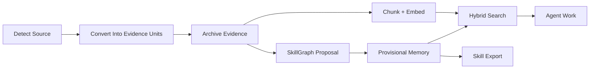

# Praxis Core

Praxis Core is the local knowledge layer at the heart of Praxis.

It turns documents, research, web pages, local files, project notes, and lessons from real work into searchable, source-traceable, reusable agent knowledge.

Core is where Praxis handles source intake, capture, retrieval, graph memory, entity-aware evidence, conflict review, governance, rollback, and skill/reference export.

The main surfaces are:

| Area | What Core Handles |
| --- | --- |
| Ingestion | Source detection, conversion, capture, raw evidence, summaries, metadata, chunking, and embeddings. |
| Retrieval | Hybrid search across vector hits, keyword hits, SkillGraph hints, optional entity-aware hints, and context-priority scoring. |
| Evidence | Source IDs, capture IDs, graph links, entity-aware evidence annotations, and explanation output. |
| Hygiene | Conflict records, dedupe records, authority anchors, governance checks, rollback, and hash-chain receipts. |
| Reuse | SkillGraph updates, Markdown reference export, and skill-supporting files. |

## What Core Is For

Use Praxis Core when you want agents to remember and reuse knowledge without stuffing everything into the prompt.

Core is useful for:

- coding agents that should reuse project lessons;
- research agents that need source-backed claims;
- teams building RAG systems with provenance;
- people maintaining private documentation or research libraries;
- agent skill builders who want `SKILL.md`-style files backed by real sources;
- workflows where memory needs to be searchable, inspectable, and reversible.

## How Core Works



Core does not treat captured text as automatically true. It stores the evidence, records how knowledge entered the system, and makes changes reversible.

Intake runs before capture. It detects file type, chooses a converter, preserves converter metadata, and records parse-quality warnings. It can also create source-linked media evidence from transcripts, keyframes, OCR, speaker turns, and visual embeddings when optional local adapters are installed. See [Praxis Intake](intake.md).

## Core Deep Dives

Use these pages when you want to understand why Praxis Core behaves differently from a typical RAG stack:

- [How Praxis Core Is Different](how-core-is-different.md): the short comparison against plain chunk-and-vector retrieval.
- [Core Architecture](core-architecture.md): the local workspace, SQLite control plane, package layout, and runtime boundaries.
- [Ingestion Pipeline](ingestion-pipeline.md): how sources become captures, provisional graph changes, chunks, embeddings, and entity-aware evidence.
- [Retrieval Pipeline](retrieval-pipeline.md): how Core combines vector, keyword, graph, entity, trust, freshness, status, and conflict signals.
- [Entity-Aware Evidence](entity-aware-evidence.md): how entity mentions become accepted evidence annotations such as `ann:...`.
- [Maintenance And Hygiene](maintenance-and-hygiene.md): how Core keeps local knowledge inspectable, reversible, and reviewable.
- [Conflicts And Dedupe](conflicts-and-dedupe.md): how duplicate and contradictory knowledge is surfaced and resolved.

## First Run

Run the demo:

```bash
praxis demo core
```

Or run the pieces manually:

```bash
praxis bootstrap
praxis doctor --require-index
praxis ingest "https://example.com/source"
praxis chunk --changed-only
praxis embed --provider local-hash
praxis search "what did this source teach us?" --explain
```

## Common Core Commands

| Command | What It Does |
| --- | --- |
| `praxis intake` | Inspects and converts sources before they enter memory. |
| `praxis capture` | Captures a URL, file, or directory. |
| `praxis ingest` | Captures a source and writes provisional SkillGraph memory. |
| `praxis chunk` | Turns captured sources into searchable chunks. |
| `praxis embed` | Embeds pending chunks. |
| `praxis search` | Runs hybrid semantic, keyword, and graph search. |
| `praxis graph` | Searches or traverses the SkillGraph. |
| `praxis changes` | Lists and inspects graph change sets. |
| `praxis entities` | Extracts entity mentions, resolves them against SkillGraph aliases, and creates evidence annotations. |
| `praxis conflicts` | Lists and resolves conflict records. |
| `praxis dedupe` | Reviews duplicate source/entity candidates. |
| `praxis rollback` | Reverts an audited change set. |
| `praxis authority` | Manages source-of-record authority anchors. |
| `praxis governance` | Checks evidence reuse, authority, conflicts, and governance receipts. |
| `praxis export-skill-refs` | Exports selected knowledge into reusable Markdown references. |

## Search And Ranking

`praxis search` ranks by context priority by default.

That means Praxis considers:

- semantic relevance;
- keyword relevance;
- graph links;
- accepted entity links when `--entity-aware` is used;
- source trust;
- freshness;
- active/deprecated status;
- unresolved conflicts.

Use this when you want the most useful context first:

```bash
praxis search "chunking strategy for RAG" --explain
```

Use raw retrieval order when debugging:

```bash
praxis search "chunking strategy for RAG" --rank-by relevance
```

Use entity-aware search after extracting and resolving mentions:

```bash
praxis entities extract --changed-only
praxis entities resolve
praxis entities explain "Acme"
praxis search "Acme renewal risk" --entity-aware --explain
```

Entity-aware retrieval keeps raw mentions in the semantic index, resolves them against canonical SkillGraph nodes and aliases, then emits evidence annotations such as `ann:...`. Governance can evaluate those annotations before they are reused as durable knowledge.

## Conflict And Dedupe Handling

Core can log:

- duplicate URLs;
- duplicate content hashes;
- similar titles;
- possible duplicate entities;
- claim-like contradictions.

Conflict records are not magic truth judgments. They are warning lights. They help you inspect suspicious memory before it spreads into search or skill exports.

## Authority Anchors

Core also includes an experimental authority layer exposed as `praxis authority`.

Authority anchors define which source is allowed to settle a type of claim. For example, a CRM may be authoritative for opportunity stage, while an ad platform is only context for that same claim.

See [Praxis Authority Anchors](authority.md).

## Core Governance

Core governance is exposed as `praxis governance`.

It validates evidence references, checks source authority, reports unresolved conflicts, records policy evaluations, and verifies a local hash-chain ledger of governance events.

See [Praxis Core Governance](governance.md).

## Skill Export

Core can export reviewed knowledge into skill-supporting files:

```bash
praxis export-skill-refs
```

This is the bridge between RAG and skills: useful knowledge can start as source evidence, become searchable memory, and later become reusable agent instructions.

## What Core Does Not Do Yet

Core is not a hosted memory service, not a production vector database, not a hardened enterprise policy engine, and not an autonomous agent runtime.

It gives you a local, inspectable knowledge layer that other agents and runtimes can use.
