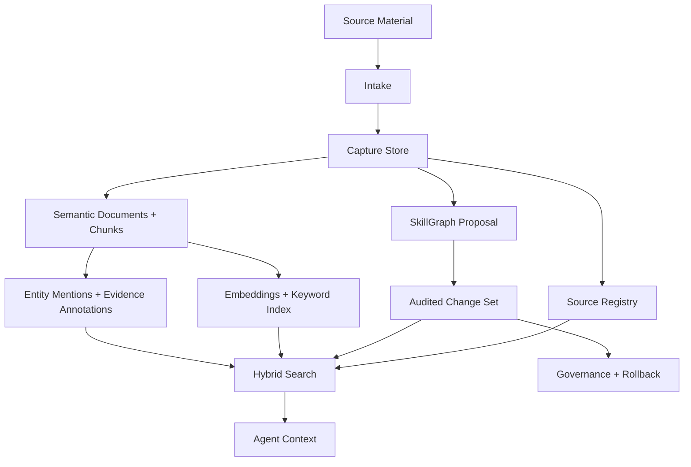

# Core Architecture

Praxis Core is organized around a local checkout, local generated state, and explicit evidence records.

Run a quick local check:

```bash
praxis doctor --require-index
```

## Main Layers



## Local Workspace

Praxis stores generated runtime state under `workspace/`.

Important Core areas include:

| Area | Purpose |
| --- | --- |
| `workspace/research/captures/` | Raw captured text, summaries, source metadata, and copied artifacts. |
| `workspace/kg/` | SkillGraph, source registry, graph changes, conflicts, and graph audit records. |
| `workspace/vectors/` | Semantic documents, chunks, embeddings, FTS rows, entity mentions, and evidence annotations. |
| `workspace/authority/` | Authority anchor bundles and compiled authority data. |
| `workspace/governance/` | Governance events, receipts, and policy evaluation state. |
| `workspace/exports/` | Generated Markdown references and skill-supporting files. |

Most generated files in `workspace/` are ignored by git.

## Code Layout

| Package Area | Purpose |
| --- | --- |
| `src/praxis/commands/` | CLI command implementations such as ingest, chunk, embed, search, conflicts, dedupe, rollback, and export. |
| `src/praxis/intake/` | Source detection, conversion, parse-quality metadata, media helpers, and evidence-unit creation. |
| `src/praxis/entities/` | Entity mention extraction, resolution, evidence annotations, and entity-aware retrieval helpers. |
| `src/praxis/authority/` | Source-of-record anchors and adjudication records. |
| `src/praxis/governance/` | Evidence checks, policy checks, governance events, and ledger verification. |
| `src/praxis/reach/` | Operational evidence cards, context packs, manifests, freshness, and connectors built on top of Core patterns. |
| `src/praxis/agency/` | Client capsules and multi-client workflow orchestration built on top of Reach and Core. |

## Design Rule

Core keeps source-controlled code separate from generated local state.

The source-controlled repo contains:

- package code;
- docs;
- tests;
- bootstrap schemas and seed files;
- examples;
- scripts.

The generated workspace contains:

- captures;
- SQLite databases;
- chunks and embeddings;
- evidence annotations;
- governance receipts;
- exported references;
- local client and Reach artifacts.

This keeps private or generated data out of the public repo while still making the runtime inspectable.

## Current Boundary

Praxis Core is local-first. It can be used by agent runtimes and frameworks, but it is not itself a hosted multi-user app or autonomous agent runtime.
