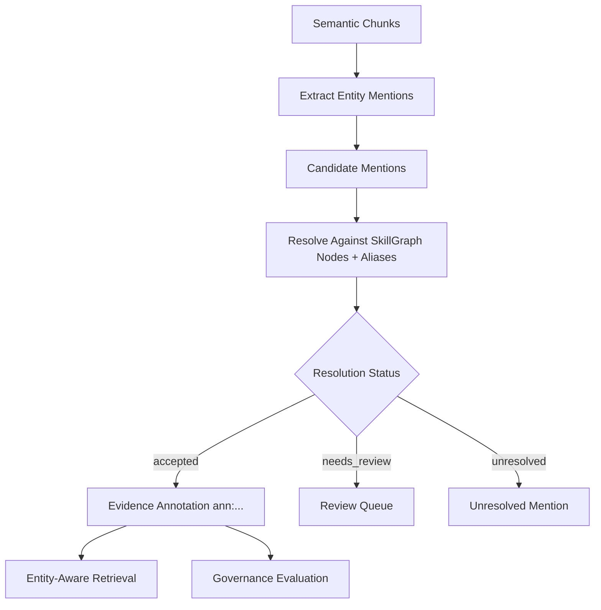

# Entity-Aware Evidence

Entity-aware evidence is the current Core mechanism behind what people may casually call "entity cards."

Run the basic flow:

```bash
praxis entities init
praxis entities extract --changed-only
praxis entities resolve
praxis entities mentions --status accepted
praxis search "Acme pipeline" --entity-aware --explain
```

## Naming Boundary

The implementation currently stores entity evidence as evidence annotations, not as a table literally named `entity_cards`.

The useful product idea is the same: Praxis creates an inspectable evidence object around a detected entity mention so later retrieval can reuse it with provenance.

In current code, that object is an `evidence_annotations` row with an ID like:

```text
ann:...
```

## Entity Evidence Lifecycle



## 1. Canonical Entities Come From SkillGraph

Entity resolution uses active and provisional SkillGraph nodes plus aliases as canonical targets.

That means entity-aware retrieval is tied to the knowledge graph, but it does not blindly create canonical entities from every phrase.

## 2. Extraction Finds Mentions In Chunks

`praxis entities extract` scans semantic chunks.

It can detect:

- known aliases from SkillGraph nodes;
- optional capitalized phrase candidates when pattern extraction is enabled.

Mention records keep source location:

- chunk ID;
- document ID;
- chunk text hash;
- offsets.

They also keep extraction state:

- surface text;
- normalized text;
- entity type;
- extractor name;
- confidence;
- status.

## 3. Resolution Links Mentions To Canonical Entities

`praxis entities resolve` compares mentions against SkillGraph nodes and aliases.

Resolution methods include:

- extractor hints;
- exact alias matches;
- fuzzy alias matches.

High-confidence single matches can become accepted. Ambiguous or fuzzy matches go to `needs_review`.

Inspect accepted mentions:

```bash
praxis entities mentions --status accepted
```

Inspect review candidates:

```bash
praxis entities mentions --status needs_review
```

## 4. Accepted Mentions Create Evidence Annotations

When a mention is accepted, Core creates an evidence annotation.

The annotation stores:

- annotation type;
- source chunk IDs;
- resolved entity IDs;
- extracted mention payload;
- confidence;
- status;
- extractor;
- governance metadata.

Inspect one annotation:

```bash
praxis entities annotation "ann:..."
```

## 5. Retrieval Can Use Accepted Entity Links

Entity-aware search uses accepted mentions as another retrieval signal.

```bash
praxis entities explain "Acme"
praxis entities search "Acme pipeline" --show-text
praxis search "Acme pipeline" --entity-aware --explain
```

This helps when raw text has aliases, partial names, or repeated entities across several chunks.

## 6. Governance Can Evaluate Entity Evidence

Entity annotations can be evaluated as evidence:

```bash
praxis governance evaluate \
  --claim-type entity_identity \
  --source entity_annotation \
  --evidence "ann:..."
```

The governance check can report the evidence kind, entity resolution status, and resolved entity IDs.

## Why This Is Different From Plain RAG

Plain RAG usually retrieves chunks that mention a string.

Praxis can keep a reviewable link between:

- a chunk;
- a surface mention;
- a normalized mention;
- a canonical SkillGraph entity;
- an evidence annotation;
- a governance status;
- an entity-aware retrieval signal.

That gives an agent something more inspectable than "this chunk was close to the query."

## Current Boundary

Entity-aware evidence is additive to chunk retrieval. It does not replace chunks, does not automatically promote every entity candidate, and does not yet expose a public `compare_entities` command.

Relation hardening now has a separate user-facing command surface:

```bash
praxis relationship-evidence extract
praxis relationship-evidence promote
praxis relationship-evidence query --subject "Acme"
```

Use [Relationship Evidence](relationship-evidence.md) when you want relationships between entities to become reviewable candidates and accepted graph edges.
