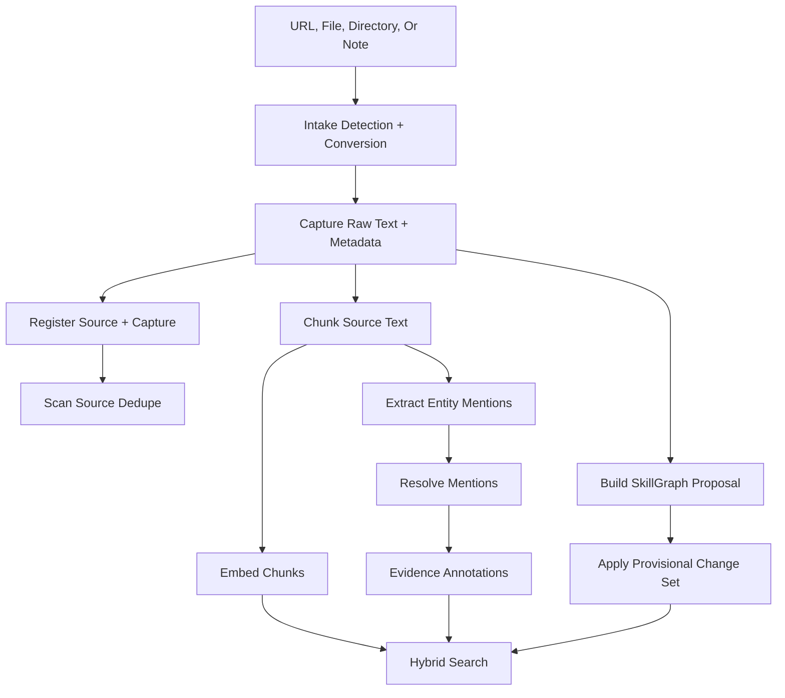

# Ingestion Pipeline

Praxis Core ingestion turns source material into captured evidence, provisional graph memory, searchable chunks, embeddings, and optional entity-aware evidence annotations.

Run the fast path:

```bash
praxis ingest "https://example.com/source"
praxis chunk --changed-only
praxis embed --provider local-hash
praxis search "what did this source teach us?" --explain
```

## Pipeline At A Glance



## 1. Intake

Intake runs before capture when a source needs conversion.

Use it directly when you want to inspect extraction quality before adding a source:

```bash
praxis intake inspect ./docs/file.pdf
praxis intake convert ./docs/file.pdf --json --include-units
```

Intake can preserve:

- detected media type;
- converter name;
- converter metadata;
- parse-quality score;
- parse warnings;
- extracted evidence units;
- optional transcript, OCR, keyframe, speaker, or visual embedding metadata when those optional helpers are installed.

See [Praxis Intake](intake.md).

## 2. Capture

Capture writes local source artifacts under `workspace/research/captures/`.

For a captured source, Praxis records identity and quality fields:

- `source_id`;
- `capture_id`;
- title;
- source type;
- content hash;
- credibility score;
- freshness window.

It also records local artifact paths:

- raw text path;
- summary path;
- metadata path;
- copied source artifact path when available.

Capture also registers the source and capture in the local SkillGraph database.

## 3. Source Dedupe Scan

After capture, Core scans for source-level duplication signals.

It can flag:

- duplicate source IDs;
- duplicate URLs;
- duplicate content hashes;
- suspiciously similar source records.

These warnings go into the conflict ledger instead of silently overwriting memory.

## 4. Provisional SkillGraph Update

`praxis ingest` does more than capture text. It also builds and applies a provisional SkillGraph proposal.

The command prints a rollback path:

```text
Rollback if needed:
  praxis rollback chg:...
```

This is intentional. Ingested knowledge can be useful quickly without becoming irreversible.

Review related changes with:

```bash
praxis changes list
praxis changes show "chg:..."
```

## 5. Chunking

Chunking turns captured material and selected local files into semantic documents and chunks.

```bash
praxis chunk --changed-only
```

Chunk records preserve document identity:

- document ID;
- source ID;
- capture ID;
- title;
- path or URL;
- section.

They also preserve retrieval and quality metadata:

- text hash;
- token estimate;
- confidence;
- source metadata;
- graph link hints where available.

## 6. Embedding

Embedding writes vector rows for chunks that do not already have embeddings for the selected model.

```bash
praxis embed --provider local-hash
```

Core supports local-hash embeddings for deterministic local demos and optional OpenAI embeddings when configured.

## 7. Entity-Aware Evidence

After chunking, Core can extract and resolve entity mentions.

```bash
praxis entities init
praxis entities extract --changed-only
praxis entities resolve
praxis entities mentions --status accepted
```

Accepted entity mentions create evidence annotations with IDs such as `ann:...`.

People may describe these as "entity cards." In the current implementation, the durable primitive is an entity-aware evidence annotation: a record linked to source chunks, resolved SkillGraph entity IDs, confidence, extraction metadata, and governance metadata.

See [Entity-Aware Evidence](entity-aware-evidence.md).

## 8. Search And Reuse

Once chunks and embeddings exist, search can use the source, graph, and entity signals.

```bash
praxis search "Acme renewal risk" --entity-aware --explain
```

Reviewed knowledge can later be exported:

```bash
praxis export-skill-refs
```

## Current Boundary

The ingestion pipeline works locally. It does not mean every extracted graph object or entity mention is automatically high-trust. Provisional graph changes, conflict warnings, entity statuses, authority checks, and governance checks are how Praxis keeps ingestion inspectable.
