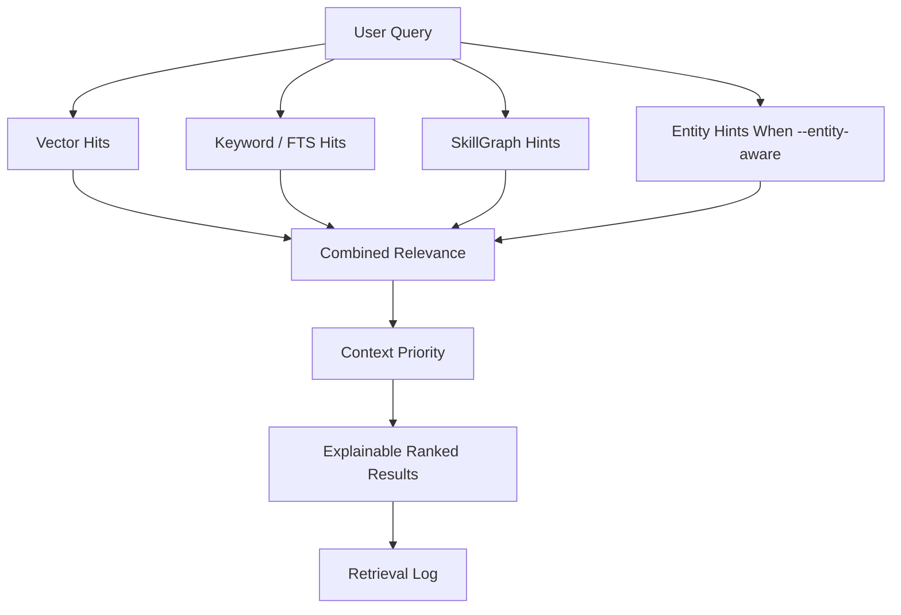

# Retrieval Pipeline

Praxis Core retrieval combines semantic search, keyword search, SkillGraph hints, optional entity-aware evidence, and context-priority scoring.

Run a search with explanations:

```bash
praxis search "Acme renewal risk" --entity-aware --explain
```

## Pipeline At A Glance



## 1. Vector Hits

Vector search retrieves semantic chunks from the local vector index.

This gives Core broad meaning-based recall over captured and chunked material.

## 2. Keyword Hits

Keyword search uses the local full-text index.

This catches exact names, identifiers, phrases, and terms that semantic search can blur.

## 3. SkillGraph Hints

Praxis searches the SkillGraph for nodes and aliases related to the query.

Graph hints can affect ranking when a chunk is linked to a relevant node or when a node name appears in the chunk text.

## 4. Entity-Aware Hints

When `--entity-aware` is enabled, Core looks for accepted entity mentions related to the query.

```bash
praxis entities explain "Acme"
praxis entities search "Acme pipeline" --show-text
praxis search "Acme pipeline" --entity-aware --explain
```

Entity-aware retrieval adds a separate entity signal to matching chunks. This lets a query benefit from resolved mentions and aliases instead of only raw text similarity.

## 5. Combined Relevance

Praxis combines retrieval signals into a relevance score.

Current search signals include:

- vector score;
- keyword score;
- graph score;
- entity score when `--entity-aware` is used.

The default weights are tuned for a balanced hybrid search rather than pure vector ranking.

## 6. Context Priority

By default, Core sorts by context priority, not raw relevance alone.

Context priority considers:

- retrieval relevance;
- source trust;
- freshness;
- graph connection;
- active or deprecated status;
- unresolved conflict penalties.

Use raw relevance order when debugging retrieval mechanics:

```bash
praxis search "chunking strategy" --rank-by relevance --explain
```

## 7. Explanation Output

Use `--explain` to see why a result appeared.

Explanation output can show ranking signals:

- priority;
- relevance;
- vector score;
- keyword score;
- graph score;
- entity score.

It can also show provenance and safety signals:

- source ID;
- capture ID;
- confidence;
- intake metadata;
- graph links;
- entity links;
- governance warnings;
- conflict warnings.

## How Comparisons Work Today

Praxis does not currently expose a public `compare_entities` command.

What it does today is compare retrieval candidates across multiple evidence signals. A result can rank higher because it is semantically relevant, exact-keyword relevant, linked to the right graph nodes, connected to accepted entity annotations, fresh, trusted, active, and free of open conflicts.

For entity comparison work today, the practical flow is:

```bash
praxis entities explain "Acme"
praxis entities explain "Beta"
praxis entities search "Acme pipeline" --show-text
praxis entities search "Beta pipeline" --show-text
praxis search "Acme Beta pipeline" --entity-aware --explain
```

That gives you the supported chunks, resolved entity IDs, annotations, and conflict warnings needed to compare evidence manually or in an agent workflow.

## Retrieval Logs

Hybrid search writes retrieval metadata when possible. Logs can include top chunk IDs, top scores, graph nodes, entity links, conflict counts, and priority breakdowns.

This makes retrieval behavior easier to inspect after a surprising answer.

## Current Boundary

Core retrieval is explainable and multi-signal, but it is not a full answer-synthesis engine. It returns ranked evidence. Agent runtimes or downstream workflows can use that evidence to draft answers, compare entities, or generate reports.
